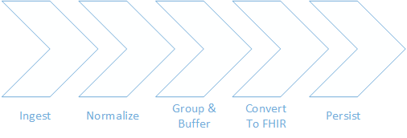
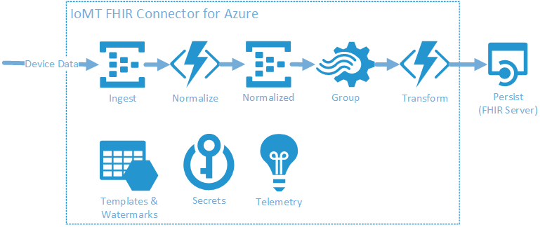

# IoMT FHIR Connector for Azure

The IoMT FHIR Connector for Azure is an open-source project for ingesting data from IoMT (internet of medical things) devices and persisting the data in a FHIR&reg; server. The goal of this Microsoft Healthcare project is to enable developers to rapidly deploy a service for ingesting high frequency IoMT data and landing the data in a FHIR server of their choice.

Device data can be written to directly to the IoMT FHIR Connector for Azure or seamlessly used in concert with other Azure IoT solutions (IoT Hub and IoT Central).  The connector does not provide device security or management which are covered by the Azure IoT solutions mentioned.

The IoMT FHIR Connector for Azure is built with extensibility in mind, enabling developers to modify and extend the capabilities to support additional device mapping template types and FHIR resources. The different points for extension are:
* Normalization: Device data information is extracted into a common format for further processing.
* FHIR Conversion: Normalized and grouped data is mapped to FHIR.  Observations are created or updated according to configured templates and linked to the device and patient.

The IoMT FHIR Connector for Azure empowers developers – saving time when they need to quickly integrate IoMT data into their FHIR server for use in their own applications or providing them with a foundation on which they can customize their own IoMT FHIR connector service. As an open source project, contributions and feedback from the FHIR developer community will continue to improve this project.

Privacy and security are top priorities and the IoMT FHIR Connector for Azure has been developed in support of requirements for Protected Health Information (PHI). All the Azure services used in IoMT FHIR Connector for Azure [meet the compliance requirements for Protected Health Information](https://www.microsoft.com/en-us/trustcenter/compliance/complianceofferings).

This open source project is fully backed by the Microsoft Healthcare team, but we know that this project will only get better with your feedback and contributions. We are leading the development of this code base, and test builds and deployments daily.

# Setup and Requirements
- R4 FHIR server with support for Device, Patient, and Observation resources.
- OAuth 2.0 identity provider with configured [client credentials](https://docs.microsoft.com/en-us/azure/active-directory/develop/v2-oauth2-client-creds-grant-flow) granted access to the FHIR server.
- An existing device resource and patient resource on the FHIR server. The device should be linked to the patient. Please note the identity extracted for the device during the normalization step should be a device identifier not the internal id.
- A device content template uploaded to the template storage container. See [Configuration](./docs/Configuration.md) for more information.
- A FHIR mapping template uploaded to the template storage container. See [Configuration](./docs/Configuration.md) for more information.

# Getting Started
To get started, there are a few options:
1. Deploy the [IoMT FHIR Connector for Azure](./docs/ARMInstallation.md) by itself for use with Azure API for FHIR and Azure Active directory in the same subscription. Requests made to the Azure API for FHIR will be authenticated using the Azure Active Directory within this subscription - External identity providers cannot be used if the IoMT FHIR Connector for Azure is deployed with this template.
2. Start with a complete [sandbox environment](./docs/Sandbox.md) that includes an instance of [IoT Central](https://azure.microsoft.com/en-us/services/iot-central/) with simulated devices and a deployed instance of the [Azure API for FHIR](https://docs.microsoft.com/en-us/azure/healthcare-apis/).

To send messages to the connector you can [send events](https://docs.microsoft.com/en-us/azure/event-hubs/event-hubs-dotnet-standard-getstarted-send) directly to the `devicedata` EventHub deployed as part of IoMT FHIR Connector for Azure or [send events](https://docs.microsoft.com/en-us/azure/iot-hub/iot-hub-devguide-sdks) to one of the Azure IoT solutions and [export messages](./docs/Iot.md) to the connector. 

# Architecture

* **Ingest**: The ingestion point for device data is an Event Hub. [Scale](https://docs.microsoft.com/en-us/azure/event-hubs/event-hubs-faq#throughput-units) your Event Hub throughput units based on your message volume.
* **Normalize**: Device data is processed and compared to templates defined in the `devicecontent.json` configuration file.  Types, values, and other important information are extracted.  The output is written to a second Event Hub.
* **Group**: Normalized data is grouped according to device identity, measurement type, and the configured time period.  The time period controls the latency that observations are written to FHIR.
* **Transform**: Output from the group and buffering stage is processed.  Observations are created by matching the types from the grouped normalized data to the templates defined in the `fhirmapping.json` configuration file. It is at this point that the device is retrieved from the FHIR server along with the associated patient.  

    **Note** all identity look ups are cached once resolved to decrease load on the FHIR server.  If you plan on reusing devices with multiple patients it is advised you create a *virtual device* resource that is specific to the patient and the virtual device identifier is what is sent in the message payload. The virtual device can be linked to the actual device resource as a parent.
* **Persist**: Once the observation is generated in the FHIR conversion step it is created or merged in the configured destination FHIR server.

## Azure Architecture

# Documentation
- [Configuration](./docs/Configuration.md): Documents the different configurations required for the connector.
- [Open Source Deployment using Managed Identity](./docs/ARMInstallation.md): Describes how to deploy the IoMT FHIR Connector for Azure using Azure API for FHIR and Azure Active directory in the same subscription.
- [Sandbox Deployment](./docs/Sandbox.md): Describes how to deploy an end to end sandbox environment using IoT Central, IoMT FHIR Connector for Azure, and the Azure API for FHIR.
- [Connecting to Azure IoT](./docs/Iot.md): Describes how to connect the IoMT FHIR Connector for Azure with different Azure IoT solutions like IoT Hub and IoT Central.
- [Debugging](./docs/Debugging.md): Documents steps for local and cloud debugging.

# Additional tools

## IoMT Connector Data Mapper

The IoMT Connector Data Mapper is a tool to visualize the mapping configuration for normalizing the device input data and transform it to the FHIR resources. Developers can use this tool to edit and test the mappings, device mapping and FHIR mapping, and export them for uploading to the IoT Connector in the Azure portal. The tool also gives tutorials for developers to understand the mapping configuration.
[Click here for additional details](./tools/data-mapper/)

# More Information
- [Azure API for FHIR](https://docs.microsoft.com/en-us/azure/healthcare-apis/)
- Blog: [Accelerate IoMT on FHIR with new Microsoft OSS Connector](https://azure.microsoft.com/en-us/blog/accelerate-iomt-on-fhir-with-new-microsoft-oss-connector/)

# Contributing

This project welcomes contributions and suggestions.  Most contributions require you to agree to a
Contributor License Agreement (CLA) declaring that you have the right to, and actually do, grant us
the rights to use your contribution. For details, visit https://cla.microsoft.com.

When you submit a pull request, a CLA-bot will automatically determine whether you need to provide
a CLA and decorate the PR appropriately (e.g., label, comment). Simply follow the instructions
provided by the bot. You will only need to do this once across all repos using our CLA.

There are many other ways to contribute to IoMT FHIR Connector for Azure.
* [Submit bugs](https://github.com/Microsoft/iomt-fhir/issues) and help us verify fixes as they are checked in.
* Review the [source code changes](https://github.com/Microsoft/iomt-fhir/pulls).
* Engage with IoMT FHIR Connector for Azure users and developers on [StackOverflow](https://stackoverflow.com/questions/tagged/iomt-fhir-connector-for-azure).
* [Contribute bug fixes](CONTRIBUTING.md).

See [Contributing to IoMT FHIR Connector for Azure](CONTRIBUTING.md) for more information.

This project has adopted the [Microsoft Open Source Code of Conduct](https://opensource.microsoft.com/codeofconduct/).
For more information see the [Code of Conduct FAQ](https://opensource.microsoft.com/codeofconduct/faq/) or
contact [opencode@microsoft.com](mailto:opencode@microsoft.com) with any additional questions or comments.

FHIR&reg; is the registered trademark of HL7 and is used with the permission of HL7. 