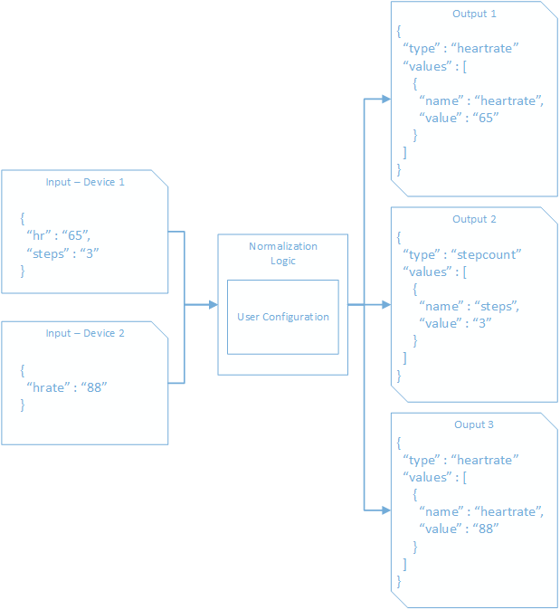

- [Configuration](#configuration)
- [Device Content Mapping](#device-content-mapping)
  - [Templates](#templates)
  - [**CalculatedContentTemplate**](#calculatedcontenttemplate)
    - [Expression Languages](#expression-languages)
    - [Custom Functions](#custom-functions)
    - [Matched Token](#matched-token)
      - [Examples](#examples)
  - [**JsonPathContentTemplate**](#jsonpathcontenttemplate)
    - [Examples](#examples-1)
  - [**IotJsonPathContentTemplate**](#iotjsonpathcontenttemplate)
    - [Examples](#examples-2)
  - [**IotCentralJsonPathContentTemplate**](#iotcentraljsonpathcontenttemplate)
    - [Examples](#examples-3)
- [FHIR Mapping](#fhir-mapping)
  - [CodeValueFhirTemplate](#codevaluefhirtemplate)
  - [Value Type Templates](#value-type-templates)
    - [SampledData](#sampleddata)
    - [Quantity](#quantity)
    - [String](#string)
    - [CodeableConcept](#codeableconcept)
  - [Examples](#examples-4)

# Configuration

This article details how to configure your instance of the IoMT FHIR Connector for Azure.

The IoMT FHIR Connector for Azure requires two JSON configuration files.  The first, device content, is responsible for mapping the payloads sent to the Event Hub end point and extracting types, device identifiers, measurement date time, and the measurement value(s).  The second template controls the FHIR mapping.  The FHIR mapping allows configuration of the length of the observation period, FHIR data type used to store the values, and code(s).  The two configuration files should be uploaded to the storage container "template" created under the blob storage account provisioned during the [ARM template deployment](ARMInstallation.md). The device content mapping file **MUST** be named `devicecontent.json` and the FHIR mapping file **MUST** be named `fhirmapping.json`. Full examples can be found in the repository under [/sample/templates](../sample/templates).  Configuration files are loaded from blob per compute execution.  Once updated they should take effect immediately.

# Device Content Mapping

Using user provided mapping templates, the IoMT FHIR Connector for Azure is able to extract data from Event Hub messages into a common format for further evaluation.  Each event hub message received is evaluated against all templates. This allows a single inbound message to be projected to multiple outbound messages and subsequently mapped to different observations in FHIR.  The result is a normalized data object representing the value or values parsed by the templates.  The normalized data model has a few required properties that must be found and extracted:

| Property             | Description                                                                                                                                                                                                                                             |
|----------------------|---------------------------------------------------------------------------------------------------------------------------------------------------------------------------------------------------------------------------------------------------------|
| **Type**             | The name/type to classify the measurement.  This is used to bind to the desired FHIR mapping template.  Multiple templates can output to the same type allowing you to map different representations across multiple devices to a single common output. |
| **OccurenceTimeUtc** | The time the measurement occurred.                                                                                                                                                                                                                      |
| **DeviceId**         | The identifier for the device.  This should match an identifier on the device resource that resides on the destination FHIR server.                                                                                                                     |
 |**Properties**|Extract at least one property so the value can be saved in the observation created.  Properties are a collection of key value pairs extracted during normalization.|

The full normalized model is defined by the [IMeasurement](../src/lib/Microsoft.Health.Fhir.Ingest.Schema/IMeasurement.cs) interface.

Below is a conceptual example of what happens during normalization.

 

Given the above, below is an example of the [Measurement](../src/lib/Microsoft.Health.Fhir.Ingest.Schema/IMeasurement.cs) produced for the **heartrate** value:
```json
{
    "Type": "heartrate",
    "OccurrenceTimeUtc": "2019-02-01T22:46:01.875Z",
    "IngestionTimeUtc": null,
    "DeviceId": "device123",
    "PatientId": null,
    "EncounterId": null,
    "CorrelationId": null,
    "Properties": [
      {
        "Name": "hr",
        "Value": "65"
      }
    ]
  }
```

 The content payload itself is an event hub message which is composed of three parts: Body, Properties, and SystemProperties.  The `Body` is a byte array representing an UTF-8 encoded string.  During template evaluation the byte array is automatically converted into the string value. `Properties` is a key value collection for use by the message creator.  `SystemProperties` is also a key value collection reserved by the EventHub framework with entries automatically populated by EventHub.

 ```json
 {
     "Body" :
     {
         "content" : "value"
     },
     "Properties" :
     {
         "key1" : "value1",
         "key2" : "value2"
     },
     "SystemProperties" :
     {
         "x-opt-sequence-number" : 1,
         "x-opt-enqueued-time" : "2019-02-01T22:46:01.8750000Z",
         "x-opt-offset" : 1,
         "x-opt-partition-key" : "1"
     }
 }
 ```

## Templates

Users can define one or more templates within their device mapping file. Each event hub message received is evaluated against all templates. This allows a single inbound message to be projected to multiple outbound messages.

A variety of template types exist and may be used when building the device mapping file. 

| Name                                                                    | Description                                                                                                                                              |
|-------------------------------------------------------------------------|----------------------------------------------------------------------------------------------------------------------------------------------------------|
| CollectionContentTemplate                                               | Used to represent a list of templates which will be used during normalization                                                                            |
| [CalculatedContentTemplate](#CalculatedContentTemplate)                 | A template which supports writing expressions using one of several expressions languages. Supports data transformation via the use of JmesPath functions |
| [JsonPathContentTemplate](#JsonPathContentTemplate)                     | A template which supports writing expressions using JsonPath                                                                                             |
| [IotJsonPathContentTemplate](#IotJsonPathContentTemplate)               | Supports messages sent via Azure Iot Hub or via the Legacy Export Data feature of  Azure Iot Central.                                                    |
| [IotCentralJsonPathContentTemplate](#IotCentralJsonPathContentTemplate) | Supports messages sent via the Export Data feature of Azure Iot Central.                                                                                 |

Example:

```json
{
  "templateType": "CollectionContent",
  "template": [
    {
      "templateType": "CalculatedContent",
      "template": {
        "typeName": "heartrate",
        "typeMatchExpression": "$..[?(@heartRate)]",
        "deviceIdExpression": "$.matchedToken.deviceId",
        "timestampExpression": "$.matchedToken.endDate",
        "values": [
          {
            "required": "true",
            "valueExpression": "$.matchedToken.heartRate",
            "valueName": "hr"
          }
        ]
      }
    },
    {
      "templateType": "CalculatedContent",
      "template": {
        "typeName": "stepcount",
        "typeMatchExpression": "$..[?(@steps)]",
        "deviceIdExpression": "$.matchedToken.deviceId",
        "timestampExpression": "$.matchedToken.endDate",
        "values": [
          {
            "required": "true",
            "valueExpression": "$.matchedToken.steps",
            "valueName": "steps"
          }
        ]
      }
    }
  ]
}
```
## **CalculatedContentTemplate**

The IoMT Fhir Connector provides an expression based content template to both match the desired template and extract values. **Expressions** may be expressed using either JSON Path or JmesPath, and each expression within the template may choose its own expression language. If an expression language is not defined, the default expression language configured for the template will be used. By default this is JSONPath but can be overwritten if needed.

An expression is defined as:
```json
<name of expression> : {
        "value" : <the expression>,
        "language": <the expression language>
    }
```

In the example below, _typeMatchExpression_ is defined as:

```json
"templateType": "CalculatedContent",
    "template": {
        "typeName": "heartrate",
        "typeMatchExpression": {
            "value" : "$..[?(@heartRate)]",
            "language": "JsonPath"
        },
        ...
    }
```

The default expression language to use for a template is JsonPath. If it's desired to simply use the default language, the expression alone may be supplied:

```json
"templateType": "CalculatedContent",
    "template": {
        "typeName": "heartrate",
        "typeMatchExpression": "$..[?(@heartRate)]",
        ...
    }
```

Finally, the default expression language to use for a template can be explicitly set using the `defaultExpressionLanguage` parameter:

```json
"templateType": "CalculatedContent",
    "template": {
        "typeName": "heartrate",
        "defaultExpressionLanguage": "JsonPath",
        "typeMatchExpression": "$..[?(@heartRate)]",
        ...
    }
```

The CalculatedContentTemplate allows matching on and extracting values from an EventHub message using **Expressions** as defined above.

| Property                 | Description                                                                                                                                                                                                           | Example                      |
|--------------------------|-----------------------------------------------------------------------------------------------------------------------------------------------------------------------------------------------------------------------|------------------------------|
| TypeName                 | The type to associate with measurements that match the template.                                                                                                                                                      | heartrate                    |
| TypeMatchExpression      | The expression that is evaluated against the EventData payload. If a matching JToken is found the template is considered a match. All subsequent expressions are evaluated against the extracted JToken matched here. | $..[?(@heartRate)]           |
| TimestampExpression      | The expression to extract the timestamp value for the measurement's OccurrenceTimeUtc.                                                                                                                                | $.matchedToken.endDate       |
| DeviceIdExpression       | The expression to extract the device identifier.                                                                                                                                                                      | $.matchedToken.deviceId      |
| PatientIdExpression      | Required when IdentityResolution is in Create mode and Optional when IdentityResolution is in Lookup mode. The expression to extract the patient identifier.                                                          | $.matchedToken.patientId     |
| EncounterIdExpression    | Optional: The expression to extract the encounter identifier.                                                                                                                                                         | $.matchedToken.encounterId   |
| CorrelationIdExpression  | Optional: The expression to extract the correlation identifier. If extracted this value can be used to group values into a single observation in the FHIR mapping template.                                           | $.matchedToken.correlationId |
| Values[].ValueName       | The name to associate with the value extracted by the subsequent expression. Used to bind the desired value/component in the FHIR mapping template.                                                                   | hr                           |
| Values[].ValueExpression | The expression to extract the desired value.                                                                                                                                                                          | $.matchedToken.heartRate     |
| Values[].Required        | Will require the value to be present in the payload. If not found a measurement will not be generated and an InvalidOperationException will be thrown. A value is considered present within the payload when it is not null. If the value is a String it must also not be empty.                                                              | true                         |

### Expression Languages

When specifying the language to use for the expression, the below values are valid:
| Expression Language | Value        |
|---------------------|--------------|
| JSON Path           | **JsonPath** |
| JmesPath            | **JmesPath** |

More information on JSON Path can be found [here](https://goessner.net/articles/JsonPath/). The [CalculatedContentTemplete](#CalculatedContentTemplate) uses the [JSON .NET implementation](https://www.newtonsoft.com/json/help/html/QueryJsonSelectTokenJsonPath.htm) for resolving JSON Path expressions. Additional examples can be found in the [unit tests](../test/Microsoft.Health.Fhir.Ingest.Template.UnitTests/CalculatedFunctionContentTemplateTests.cs).

More information on JmesPath can be found [here](https://jmespath.org/specification.html). [CalculatedContentTemplete](#CalculatedContentTemplate) uses the [JmesPath .NET implementation](https://github.com/jdevillard/JmesPath.Net) for resolving JmesPath expressions.

### Custom Functions

In addtion to the functions provided as part of the specification a set of custom functions are also available for use. More information on them can be found [here](./CustomFunctions.md). Source code for the functions can be found [here](../src/lib/Microsoft.Health.Expressions)

### Matched Token
The **TypeMatchExpression** is evaluated against the incoming EventData payload. If a matching JToken is found the template is considered a match. All subsequent expressions are evaluated against a new JToken which contains both the original EventData payload as well as the extracted JToken matched here. In this way, the original payload as well as the matched object are available to each subsequent expression. The extracted JToken will be available as the property __matchedToken__.

Given the following:

_Message_

```json
{
  "Body": {
    "deviceId": "device123",
    "data": [
      {
        "systolic": "120", // Match
        "diastolic": "80", // Match 
        "date": "2021-07-13T17:29:01.061144Z"
      },
      {
        "systolic": "122", // Match
        "diastolic": "82", // Match
        "date": "2021-07-13T17:28:01.061122Z"
      }
    ]
  },
  "Properties": {},
  "SystemProperties": {}
}
```

_Template_

```json
{
  "templateType": "CollectionContent",
  "template": [
    {
      "templateType": "CalculatedContent",
      "template": {
        "typeName": "heartrate",
        "typeMatchExpression": "$..[?(@systolic && @diastolic)]", // Expression
        "deviceIdExpression": "$.Body.deviceId", // This accesses the attribute 'deviceId' which belongs to the original event data
        "timestampExpression": "$.matchedToken.date", 
        "values": [
          {
            "required": "true",
            "valueExpression": "$.matchedToken.systolic",
            "valueName": "systolic"
          },
          {
            "required": "true",
            "valueExpression": "$.matchedToken.diastolic",
            "valueName": "diastolic"
          }
        ]
      }
    }
  ]
}
```

Two matches will be extracted using the above expression and used to create JTokens. Subsequent expressions will be evaluated using the following JTokens:

```json
{
  "Body": {
    "deviceId": "device123",
    "data": [
      {
        "systolic": "120", 
        "diastolic": "80",
        "date": "2021-07-13T17:29:01.061144Z"
      },
      {
        "systolic": "122",
        "diastolic": "82",
        "date": "2021-07-13T17:28:01.061122Z"
      }
    ]
  },
  "Properties": {},
  "SystemProperties": {},
  "matchedToken" : {
      "systolic": "120",
      "diastolic": "80",
      "date": "2021-07-13T17:29:01.061144Z"
  }
}
```

And

```json
{
  "Body": {
    "deviceId": "device123",
    "data": [
      {
        "systolic": "120",
        "diastolic": "80",
        "date": "2021-07-13T17:29:01.061144Z"
      },
      {
        "systolic": "122", 
        "diastolic": "82", 
        "date": "2021-07-13T17:28:01.061122Z"
      }
    ]
  },
  "Properties": {},
  "SystemProperties": {},
  "matchedToken" : {
      "systolic": "122",
      "diastolic": "82",
      "date": "2021-07-13T17:28:01.061122Z"
    }
  }
}
```

#### Examples

---

**Heart Rate**

*Message*

```json
{
  "Body": {
    "heartRate": "78",
    "endDate": "2019-02-01T22:46:01.8750000Z",
    "deviceId": "device123"
  },
  "Properties": {},
  "SystemProperties": {}
}
```

*Template*

```json
    {
      "templateType": "CalculatedContent",
      "template": {
        "typeName": "heartrate",
        "typeMatchExpression": "$..[?(@heartRate)]",
        "deviceIdExpression": "$.matchedToken.deviceId",
        "timestampExpression": "$.matchedToken.endDate",
        "values": [
          {
            "required": "true",
            "valueExpression": "$.matchedToken.heartRate",
            "valueName": "hr"
          }
        ]
      }
    }
```

---

**Blood Pressure**

*Message*

```json
{
    "Body": {
        "systolic": "123", // Match
        "diastolic" : "87", // Match
        "endDate": "2019-02-01T22:46:01.8750000Z",
        "deviceId": "device123"
    },
    "Properties": {},
    "SystemProperties": {}
}
```

*Template*

```json
    {
      "templateType": "CalculatedContent",
      "template": {
        "typeName": "bloodpressure",
        "typeMatchExpression": "$..[?(@systolic && @diastolic)]", // Expression
        "deviceIdExpression": "$.matchedToken.deviceId",
        "timestampExpression": "$.matchedToken.endDate",
        "values": [
          {
            "required": "true",
            "valueExpression": "$.matchedToken.systolic",
            "valueName": "systolic"
          },
          {
            "required": "true",
            "valueExpression": "$.matchedToken.diastolic",
            "valueName": "diastolic"
          }
        ]
      }
    }
```

---

**Project Multiple Measurements from Single Message**

*Message*

```json
{
    "Body": {
        "heartRate": "78", // Match (Template 1)
        "steps": "2", // Match (Template 2)
        "endDate": "2019-02-01T22:46:01.8750000Z",
        "deviceId": "device123"
    },
    "Properties": {},
    "SystemProperties": {}
}
```

*Template 1*

```json
    {
      "templateType": "CalculatedContent",
      "template": {
        "typeName": "heartrate",
        "typeMatchExpression": "$..[?(@heartRate)]", // Expression
        "deviceIdExpression": "$.matchedToken.deviceId",
        "timestampExpression": "$.matchedToken.endDate",
        "values": [
          {
            "required": "true",
            "valueExpression": "$.matchedToken.heartRate",
            "valueName": "hr"
          }
        ]
      }
    },
```

*Template 2*

```json
    {
      "templateType": "CalculatedContent",
      "template": {
        "typeName": "stepcount",
        "typeMatchExpression": "$..[?(@steps)]", // Expression
        "deviceIdExpression": "$.matchedToken.deviceId",
        "timestampExpression": "$.matchedToken.endDate",
        "values": [
          {
            "required": "true",
            "valueExpression": "$.matchedToken.steps",
            "valueName": "steps"
          }
        ]
      }
    }
```

---

**Project Multiple Measurements from Array in Message**

*Message*

```json
{
  "Body": [
    {
      "heartRate": "78", // Match
      "endDate": "2019-02-01T20:46:01.8750000Z",
      "deviceId": "device123"
    },
    {
      "heartRate": "81", // Match
      "endDate": "2019-02-01T21:46:01.8750000Z",
      "deviceId": "device123"
    },
    {
      "heartRate": "72", // Match
      "endDate": "2019-02-01T22:46:01.8750000Z",
      "deviceId": "device123"
    }
  ],
  "Properties": {},
  "SystemProperties": {}
}
```

*Template*

```json
    {
      "templateType": "CalculatedContent",
      "template": {
        "typeName": "heartrate",
        "typeMatchExpression": "$..[?(@heartRate)]", // Expression
        "deviceIdExpression": "$.matchedToken.deviceId",
        "timestampExpression": "$.matchedToken.endDate",
        "values": [
          {
            "required": "true",
            "valueExpression": "$.matchedToken.heartRate",
            "valueName": "hr"
          }
        ]
      }
    }
```

---

**Project Data From Matched Token And Original Event**

*Message*

```json
{
  "Body": {
    "deviceId": "device123",
    "data": [
      {
        "systolic": "120", // Match
        "diastolic": "80", // Match 
        "date": "2021-07-13T17:29:01.061144Z"
      },
      {
        "systolic": "122", // Match
        "diastolic": "82", // Match
        "date": "2021-07-13T17:28:01.061122Z"
      }
    ]
  },
  "Properties": {},
  "SystemProperties": {}
}
```

*Template*

```json
    {
      "templateType": "CalculatedContent",
      "template": {
        "typeName": "heartrate",
        "typeMatchExpression": "$..[?(@systolic && @diastolic)]", // Expression
        "deviceIdExpression": "$.Body.deviceId", // This accesses the attribute 'deviceId' which belongs to the original event data
        "timestampExpression": "$.matchedToken.date", 
        "values": [
          {
            "required": "true",
            "valueExpression": "$.matchedToken.systolic",
            "valueName": "systolic"
          },
          {
            "required": "true",
            "valueExpression": "$.matchedToken.diastolic",
            "valueName": "diastolic"
          }
        ]
      }
    }
```

---

**Select and transform incoming data**

In the below example, height data arrives in either inches or meters. We want all normalized height data to be in meters. To achieve this we create a template which targets only height data in inches and transforms it into meters. Another template targets height data in meters and simply stores it as is.

*Message*

```json
{
  "Body": [
    {
      "height": "78",
      "unit": "inches", // Match (Template 1)
      "endDate": "2019-02-01T22:46:01.8750000Z",
      "deviceId": "device123"
    },
    {
      "height": "1.9304",
      "unit": "meters", // Match (Template 2)
      "endDate": "2019-02-01T23:46:01.8750000Z",
      "deviceId": "device123"
    }
  ],
  "Properties": {},
  "SystemProperties": {}
}
```

*Template 1*

```json
    {
      "templateType": "CalculatedContent",
      "template": {
        "typeName": "heightInMeters",
        "typeMatchExpression": "$..[?(@unit == 'inches')]",
        "deviceIdExpression": "$.matchedToken.deviceId",
        "timestampExpression": "$.matchedToken.endDate",
        "values": [
          {
            "required": "true",
            "valueExpression": {
              "value": "multiply(to_number(matchedToken.height), `0.0254`)", // Convert inches to meters. Notice we utilize JmesPath as that gives us access to transformation functions
              "language": "JmesPath"
            },
            "valueName": "height"
          }
        ]
      }
    }
```

*Template 2*

```json
    {
      "templateType": "CalculatedContent",
      "template": {
        "typeName": "heightInMeters",
        "typeMatchExpression": "$..[?(@unit == 'meters')]",
        "deviceIdExpression": "$.matchedToken.deviceId",
        "timestampExpression": "$.matchedToken.endDate",
        "values": [
          {
            "required": "true",
            "valueExpression": "$.matchedToken.height", // Simply extract the height as it is already in meters
            "valueName": "height"
          }
        ]
      }
    }
```

## **JsonPathContentTemplate**

The JsonPathContentTemplate allows matching on and extracting values from an EventHub message using JSON Path.

| Property                     | Description                                                                                                                                                                                                                                                                                |
|------------------------------|--------------------------------------------------------------------------------------------------------------------------------------------------------------------------------------------------------------------------------------------------------------------------------------------|
| **TypeName**                 | The type to associate with measurements that match the template.                                                                                                                                                                                                                           |
| **TypeMatchExpression**      | The JSON Path expression that is evaluated against the EventData payload. If a matching JToken is found the template is considered a match. All subsequent expressions are evaluated against the extracted JToken matched here.                                                            |
| **TimestampExpression**      | The JSON Path expression to extract the timestamp value for the measurement's OccurrenceTimeUtc.                                                                                                                                                                                           |
| **DeviceIdExpression**       | The JSON Path expression to extract the device identifier.                                                                                                                                                                                                                                 |
| **PatientIdExpression**      | *Required* when IdentityResolution is in [Create](ARMInstallation.md#Resource-Identity-Resolution-Type) mode and *Optional* when IdentityResolution is in [Lookup](ARMInstallation.md#Resource-Identity-Resolution-Type) mode. The JSON Path expression to extract the patient identifier. |
| **EncounterIdExpression**    | *Optional*: The JSON Path expression to extract the encounter identifier.                                                                                                                                                                                                                  |
| **CorrelationIdExpression**  | *Optional*: The JSON Path expression to extract the correlation identifier.  If extracted this value can be used to group values into a single observation in the FHIR mapping template.                                                                                                   |
| **Values[].ValueName**       | The name to associate with the value extracted by the subsequent expression. Used to bind the desired value/component in the FHIR mapping template.                                                                                                                                        |
| **Values[].ValueExpression** | The JSON Path expression to extract the desired value.                                                                                                                                                                                                                                     |
| **Values[].Required**        | Will require the value to be present in the payload.  If not found a measurement will not be generated and an InvalidOperationException will be thrown.                                                                                                                                    |

### Examples

---

**Heart Rate**

*Message*

```json
{
    "Body": {
        "heartRate": "78",
        "endDate": "2019-02-01T22:46:01.8750000Z",
        "deviceId": "device123"
    },
    "Properties": {},
    "SystemProperties": {}
}
```

*Template*

```json
{
    "templateType": "JsonPathContent",
    "template": {
        "typeName": "heartrate",
        "typeMatchExpression": "$..[?(@heartRate)]",
        "deviceIdExpression": "$.deviceId",
        "timestampExpression": "$.endDate",
        "values": [
            {
                "required": "true",
                "valueExpression": "$.heartRate",
                "valueName": "hr"
            }
        ]
    }
}
```

---

**Blood Pressure**

*Message*

```json
{
    "Body": {
        "systolic": "123",
        "diastolic" : "87",
        "endDate": "2019-02-01T22:46:01.8750000Z",
        "deviceId": "device123"
    },
    "Properties": {},
    "SystemProperties": {}
}
```

*Template*

```json
{
    "typeName": "bloodpressure",
    "typeMatchExpression": "$..[?(@systolic && @diastolic)]",
    "deviceIdExpression": "$.deviceid",
    "timestampExpression": "$.endDate",
    "values": [
        {
            "required": "true",
            "valueExpression": "$.systolic",
            "valueName": "systolic"
        },
        {
            "required": "true",
            "valueExpression": "$.diastolic",
            "valueName": "diastolic"
        }
    ]
}
```

---

**Project Multiple Measurements from Single Message**

*Message*

```json
{
    "Body": {
        "heartRate": "78",
        "steps": "2",
        "endDate": "2019-02-01T22:46:01.8750000Z",
        "deviceId": "device123"
    },
    "Properties": {},
    "SystemProperties": {}
}
```

*Template 1*

```json
{
    "templateType": "JsonPathContent",
    "template": {
        "typeName": "heartrate",
        "typeMatchExpression": "$..[?(@heartRate)]",
        "deviceIdExpression": "$.deviceId",
        "timestampExpression": "$.endDate",
        "values": [
            {
                "required": "true",
                "valueExpression": "$.heartRate",
                "valueName": "hr"
            }
        ]
    }
}
```

*Template 2*

```json
{
    "templateType": "JsonPathContent",
    "template": {
        "typeName": "stepcount",
        "typeMatchExpression": "$..[?(@steps)]",
        "deviceIdExpression": "$.deviceId",
        "timestampExpression": "$.endDate",
        "values": [
            {
                "required": "true",
                "valueExpression": "$.steps",
                "valueName": "steps"
            }
        ]
    }
}
```

---

**Project Multiple Measurements from Array in Message**

*Message*

```json
{
    "Body": [
        {
            "heartRate": "78",
            "endDate": "2019-02-01T22:46:01.8750000Z",
            "deviceId": "device123"
        },
        {
            "heartRate": "81",
            "endDate": "2019-02-01T23:46:01.8750000Z",
            "deviceId": "device123"
        },
        {
            "heartRate": "72",
            "endDate": "2019-02-01T24:46:01.8750000Z",
            "deviceId": "device123"
        }
    ],
    "Properties": {},
    "SystemProperties": {}
}
```

*Template*

```json
{
    "templateType": "JsonPathContent",
    "template": {
        "typeName": "heartrate",
        "typeMatchExpression": "$..[?(@heartRate)]",
        "deviceIdExpression": "$.deviceId",
        "timestampExpression": "$.endDate",
        "values": [
            {
                "required": "true",
                "valueExpression": "$.heartRate",
                "valueName": "hr"
            }
        ]
    }
}
```

## **IotJsonPathContentTemplate**

The IotJsonPathContentTemplate is similar to the JsonPathContentTemplate except the DeviceIdExpression and TimestampExpression are not required.

The assumption when using this template is the messages being evaluated were sent using the [Azure IoT Hub Device SDKs](https://docs.microsoft.com/en-us/azure/iot-hub/iot-hub-devguide-sdks#azure-iot-hub-device-sdks) or [Export Data (legacy)](https://docs.microsoft.com/en-us/azure/iot-central/core/howto-export-data-legacy) feature of [Azure IoT Central](https://docs.microsoft.com/en-us/azure/iot-central/core/howto-export-data). When using these SDKs the device identity (assuming the device id from IoT Hub/Central is registered as an identifer for a device resource on the destination FHIR server) is known as well as the timestamp of the message.  If you are using Azure IoT Hub Device SDKs but are using custom properties in the message body for the device identity or measurement timestamp you can still use the JsonPathContentTemplate.

*Note: When using the IotJsonPathContentTemplate the TypeMatchExpression should resolve to the entire message as a JToken.  Please see the examples below.*

### Examples

---

**Heart Rate**

*Message*
```json
{
    "Body": {
        "heartRate": "78"
    },
    "Properties": {
        "iothub-creation-time-utc" : "2019-02-01T22:46:01.8750000Z"
    },
    "SystemProperties": {
        "iothub-connection-device-id" : "device123"
    }
}
```
*Template*
```json
{
    "templateType": "JsonPathContent",
    "template": {
        "typeName": "heartrate",
        "typeMatchExpression": "$..[?(@Body.heartRate)]",
        "deviceIdExpression": "$.deviceId",
        "timestampExpression": "$.endDate",
        "values": [
            {
                "required": "true",
                "valueExpression": "$.Body.heartRate",
                "valueName": "hr"
            }
        ]
    }
}
```
---

**Blood Pressure**

*Message*
```json
{
    "Body": {
        "systolic": "123",
        "diastolic" : "87"
    },
    "Properties": {
        "iothub-creation-time-utc" : "2019-02-01T22:46:01.8750000Z"
    },
    "SystemProperties": {
        "iothub-connection-device-id" : "device123"
    }
}
```
*Template*
```json
{
    "typeName": "bloodpressure",
    "typeMatchExpression": "$..[?(@Body.systolic && @Body.diastolic)]",
    "values": [
        {
            "required": "true",
            "valueExpression": "$.Body.systolic",
            "valueName": "systolic"
        },
        {
            "required": "true",
            "valueExpression": "$.Body.diastolic",
            "valueName": "diastolic"
        }
    ]
}
```

Full example template can be found [here](https://github.com/microsoft/iomt-fhir/tree/7794cbcc463e8d26c3097cd5e2243d770f26fe45/sample/templates/legacy).

## **IotCentralJsonPathContentTemplate**

The IotCentralJsonPathContentTemplate is similar to the JsonPathContentTemplate except the DeviceIdExpression and TimestampExpression are not required.

The assumption when using this template is the messages being evaluated were sent using the [Export Data](https://docs.microsoft.com/en-us/azure/iot-central/core/howto-export-data) feature of [Azure IoT Central](https://docs.microsoft.com/en-us/azure/iot-central/core/howto-export-data). When using this feature the device identity (assuming the device id from Iot Central is registered as an identifer for a device resource on the destination FHIR server) is known as well as the timestamp of the message. If you are using this export feature but are using custom properties in the message body for the device identity or measurement timestamp you can still use the JsonPathContentTemplate.

*Note: When using the IotCentralJsonPathContentTemplate the TypeMatchExpression should resolve to the entire message as a JToken.  Please see the examples below.*

### Examples

---

**Heart Rate**

*Message*
```json
{
    "applicationId": "1dffa667-9bee-4f16-b243-25ad4151475e",
    "messageSource": "telemetry",
    "deviceId": "1vzb5ghlsg1",
    "schema": "default@v1",
    "templateId": "urn:qugj6vbw5:___qbj_27r",
    "enqueuedTime": "2020-08-05T22:26:55.455Z",
    "telemetry": {
        "Activity": "running",
        "BloodPressure": {
            "Diastolic": 7,
            "Systolic": 71
        },
        "BodyTemperature": 98.73447010562934,
        "HeartRate": 88,
        "HeartRateVariability": 17,
        "RespiratoryRate": 13
    },
    "enrichments": {
      "userSpecifiedKey": "sampleValue"
    },
    "messageProperties": {
      "messageProp": "value"
    }
}
```
*Template*
```json
{
    "templateType": "IotCentralJsonPathContent",
    "template": {
        "typeName": "heartrate",
        "typeMatchExpression": "$..[?(@telemetry.HeartRate)]",
        "values": [
            {
                "required": "true",
                "valueExpression": "$.telemetry.HeartRate",
                "valueName": "hr"
            }
        ]
    }
}
```
---
**Blood Pressure**

*Message*
```json
{
    "applicationId": "1dffa667-9bee-4f16-b243-25ad4151475e",
    "messageSource": "telemetry",
    "deviceId": "1vzb5ghlsg1",
    "schema": "default@v1",
    "templateId": "urn:qugj6vbw5:___qbj_27r",
    "enqueuedTime": "2020-08-05T22:26:55.455Z",
    "telemetry": {
        "Activity": "running",
        "BloodPressure": {
            "Diastolic": 7,
            "Systolic": 71
        },
        "BodyTemperature": 98.73447010562934,
        "HeartRate": 88,
        "HeartRateVariability": 17,
        "RespiratoryRate": 13
    },
    "enrichments": {
      "userSpecifiedKey": "sampleValue"
    },
    "messageProperties": {
      "messageProp": "value"
    }
}
```
*Template*
```json
{
    "templateType": "IotCentralJsonPathContent",
    "template": {
        "typeName": "bloodPressure",
        "typeMatchExpression": "$..[?(@telemetry.BloodPressure.Diastolic && @telemetry.BloodPressure.Systolic)]",
        "values": [
            {
                "required": "true",
                "valueExpression": "$.telemetry.BloodPressure.Diastolic",
                "valueName": "bp_diastolic"
            },
            {
                "required": "true",
                "valueExpression": "$.telemetry.BloodPressure.Systolic",
                "valueName": "bp_systolic"
            }
        ]
    }
}
```
Full example template can be found [here](https://github.com/microsoft/iomt-fhir/tree/7794cbcc463e8d26c3097cd5e2243d770f26fe45/sample/templates/sandbox).

---

# FHIR Mapping

Once the device content is extracted into [Measurement](../src/lib/Microsoft.Health.Fhir.Ingest.Schema/Measurement.cs) definitions the data is collected and grouped according to a window of time (set during deployment), device id, and type.  The output of this grouping is sent to be converted into a FHIR resource (observation currently). Here the FHIR mapping controls how the data is mapped into a FHIR observation. Should an observation be created for a point in time or over a period of an hour? What codes should be added to the observation? Should be value be represented as SampledData or a Quantity? These are all options the FHIR mapping configuration controls.

The FHIR mapping also controls how the measurements are grouped into an observation. This is controlled by the ```PeriodInterval``` setting in the template documentation below. The simplest option is ```Instance``` which means each measurement will map to a single observation.  This is option appropriate if your data collection is infrequent (a couple times a day or less).  If you are collecting data with high frequency (every second or ever minute) then using a period of ```Hour``` or ```Day``` is recommended.  When set data that arrived will be mapped to the correct hourly and daily observation.  This should be used with a value type SampledData which will capture measurements according to the period you configure.  The last option is grouping by ```CorrelationId``` which will group all measurements that share the same device, type, and correlation id (defined and extracted during device mapping).  This should also use the SampledData value type so all values with in the observation period can be represented.

## CodeValueFhirTemplate

The CodeValueFhirTemplate is currently the only template supported in FHIR mapping at this time.  It allows you defined codes, the effective period, and value of the observation. Multiple value types are supported: SampledData, CodeableConcept, String, and Quantity.  In addition to these configurable values the identifier for the observation, along with linking to the proper device and patient are handled automatically. An additional code used by IoMT FHIR Connector for Azure is also added.

| Property               |
|------------------------|
| **TypeName**           |
| **PeriodInterval**     |
| **Category**           |
| **Codes**              |
| **Codes[].Code**       |
| **Codes[].System**     |
| **Codes[].Display**    |
| **Value**              |
| **Components**         |
| **Components[].Codes** |
| **Components[].Value** |

## Value Type Templates

Each Value type defines at least the following properties:
| Property      |
|---------------|
| **ValueType** |
| **ValueName** |

Below are the currently supported value type templates. In the future further templates may be added.

### SampledData

Represents the [SampledData](http://hl7.org/fhir/datatypes.html#SampledData) FHIR data type. Measurements are written to value stream starting with start of the observations and incrementing forward using the period defined.  If no value is present an `E` will be written into the data stream.  If the period is such that two more values occupy the same position in the data stream the latest value is used.  The same logic is applied when an observation using the SampledData is updated.

| Property          |
|-------------------|
| **DefaultPeriod** |
| **Unit**          |

### Quantity

Represents the [Quantity](http://hl7.org/fhir/datatypes.html#Quantity) FHIR data type.  If more than one value is present in the grouping only the first value is used.  If new value arrives that maps to the same observation it will overwrite the old value.

| Property   |
|------------|
| **Unit**   |
| **Code**   |
| **System** |

### String

Represent the [string](https://www.hl7.org/fhir/datatypes.html#string) FHIR data type. If more than one value is present in the grouping only the first value is used. If new value arrives that maps to the same observation it will overwrite the old value.

No additional properties are defined.

### CodeableConcept

Represents the [CodeableConcept](http://hl7.org/fhir/datatypes.html#CodeableConcept) FHIR data type. The actual value isn't used.

| Property            |
|---------------------|
| **Text**            |
| **Codes**           |
| **Codes[].Code**    |
| **Codes[].System**  |
| **Codes[].Display** |

## Examples

**Heart Rate - Sampled Data**

```json
{
    "templateType": "CodeValueFhir",
    "template": {
        "codes": [
            {
                "code": "8867-4",
                "system": "http://loinc.org",
                "display": "Heart rate"
            }
        ],
        "periodInterval": 60,
        "typeName": "heartrate",
        "value": {
            "defaultPeriod": 5000,
            "unit": "count/min",
            "valueName": "hr",
            "valueType": "SampledData"
        }
    }
}
```

---

**Steps - Sampled Data**

```json
{
    "templateType": "CodeValueFhir",
    "template": {
        "codes": [
            {
                "code": "55423-8",
                "system": "http://loinc.org",
                "display": "Number of steps"
            }
        ],
        "periodInterval": 60,
        "typeName": "stepsCount",
        "value": {
            "defaultPeriod": 5000,
            "unit": "",
            "valueName": "steps",
            "valueType": "SampledData"
        }
    }
}
```

---

**Blood Pressure - Sampled Data**

```json
{
    "templateType": "CodeValueFhir",
    "template": {
        "codes": [
            {
                "code": "85354-9",
                "display": "Blood pressure panel with all children optional",
                "system": "http://loinc.org"
            }
        ],
        "periodInterval": 60,
        "typeName": "bloodpressure",
        "components": [
            {
                "codes": [
                    {
                        "code": "8867-4",
                        "display": "Diastolic blood pressure",
                        "system": "http://loinc.org"
                    }
                ],
                "value": {
                    "defaultPeriod": 5000,
                    "unit": "mmHg",
                    "valueName": "diastolic",
                    "valueType": "sampledData"
                }
            },
            {
                "codes": [
                    {
                        "code": "8480-6",
                        "display": "Systolic blood pressure",
                        "system": "http://loinc.org"
                    }
                ],
                "value": {
                    "defaultPeriod": 5000,
                    "unit": "mmHg",
                    "valueName": "systolic",
                    "valueType": "sampledData"
                }
            }
        ]
    }
}
```

---

**Blood Pressure - Quantity**

```json
{
    "templateType": "CodeValueFhir",
    "template": {
        "codes": [
            {
                "code": "85354-9",
                "display": "Blood pressure panel with all children optional",
                "system": "http://loinc.org"
            }
        ],
        "periodInterval": 0,
        "typeName": "bloodpressure",
        "components": [
            {
                "codes": [
                    {
                        "code": "8867-4",
                        "display": "Diastolic blood pressure",
                        "system": "http://loinc.org"
                    }
                ],
                "value": {
                    "unit": "mmHg",
                    "valueName": "diastolic",
                    "valueType": "quantity"
                }
            },
            {
                "codes": [
                    {
                        "code": "8480-6",
                        "display": "Systolic blood pressure",
                        "system": "http://loinc.org"
                    }
                ],
                "value": {
                    "unit": "mmHg",
                    "valueName": "systolic",
                    "valueType": "quantity"
                }
            }
        ]
    }
}
```

---

**Device Removed - Codeable Concept**

```json
{
    "templateType": "CodeValueFhir",
    "template": {
        "codes": [
            {
                "code": "deviceEvent",
                "system": "https://www.mydevice.com/v1",
                "display": "Device Event"
            }
        ],
        "periodInterval": 0,
        "typeName": "deviceRemoved",
        "value": {
            "text": "Device Removed",
            "codes": [
                {
                    "code": "deviceRemoved",
                    "system": "https://www.mydevice.com/v1",
                    "display": "Device Removed"
                }
            ],
            "valueName": "deviceRemoved",
            "valueType": "codeableConcept"
        }
    }
}
```

---
FHIR&reg; is the registered trademark of HL7 and is used with the permission of HL7.